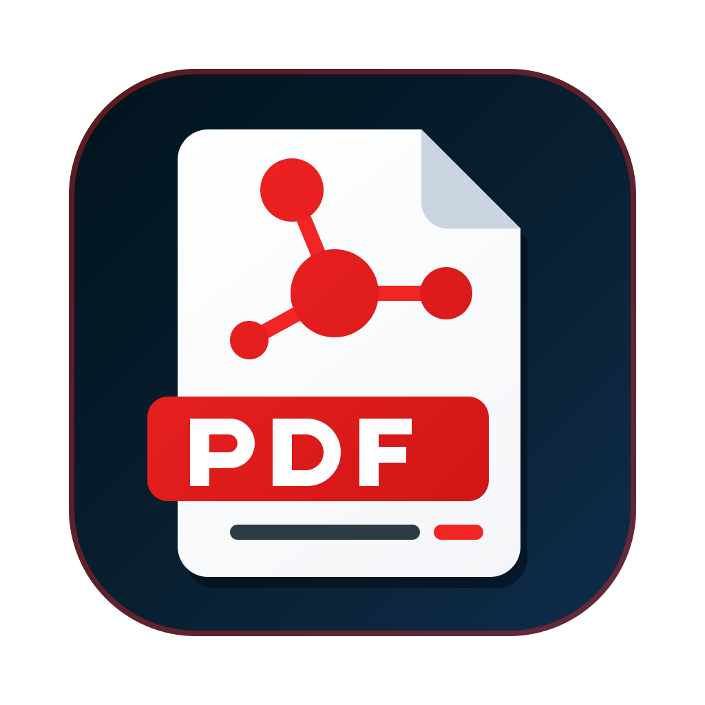
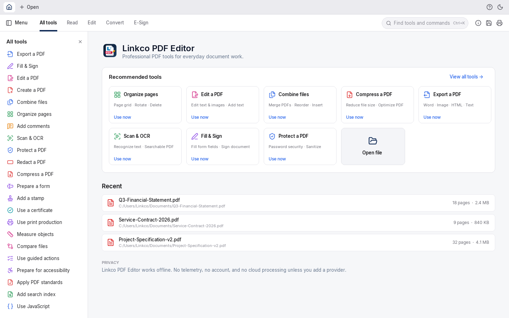
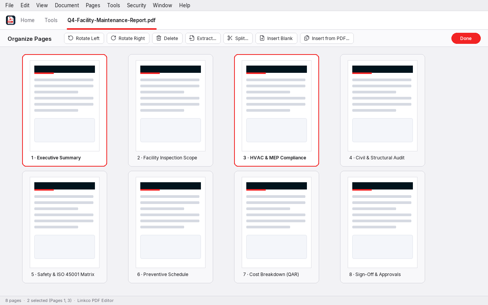

<p align="center">
  
</p>

<h1 align="center">Linkco PDF Editor</h1>

<p align="center">
  <strong>Professional PDF tools for Linkco (Al Rawabet Commercial Services &amp; Contracting Company W.L.L.)</strong><br />
  <sub>Doha, State of Qatar · C.R. No.: 32942 · ISO 9001, 14001 &amp; 45001 Certified · <code>www.linkco.com.qa</code></sub>
</p>

---

## Overview

**Linkco PDF Editor** is a native desktop PDF reader, editor, and document processing suite developed for **Linkco** (**Al Rawabet Commercial Services and Contracting Company W.L.L.** — `www.linkco.com.qa`, Doha, State of Qatar). Written entirely in safe Rust with zero `unsafe` blocks across the workspace, it provides a fast, offline-first environment for viewing, editing, organizing, converting, signing, redacting, and validating PDF documents across engineering, contracting, facility maintenance, and commercial workflows.

All document rendering and editing operations execute locally on your workstation without requiring an account, cloud upload, or telemetry connection.

---

## Features

- **Document Viewing & Navigation** — Continuous, single-page, two-up, and cover-page layouts; smooth zoom and pan; page thumbnails; hierarchical bookmarks; Optional Content Group (OCG) layer controls; file attachments; article threads; and side-by-side synchronous document comparison.
- **Page Organization** — Interactive thumbnail grid for rotating, reordering, deleting, extracting, duplicating, inserting, replacing, cropping, and splitting pages (by page count, file size, or top-level bookmarks), plus multi-file PDF combining.
- **Direct Content Editing** — Reflow-aware paragraph and line text editing, new text blocks, image insertion and replacement, headers and footers, watermarks, backgrounds, Bates numbering, link editing, and vector object inspection.
- **Annotations & Markup** — Sticky notes, highlights, underlines, strikethroughs, squiggly lines, free-text callouts, ink drawings, stamps, polygons, polylines, rectangles, ellipses, lines, arrows, carets, redaction marks, and XFDF comment import/export.
- **Interactive Forms & E-Sign** — Full AcroForm field filling and authoring (text, checkbox, radio button, combo box, list box, push button, signature field, barcode), sandboxed `AF*` calculation/validation scripts, and **Fill & Sign** tools (text, checkmarks, crosses, dots, lines, dates, drawn/typed/image signatures, and initials).
- **Digital Signatures & Certificates** — PKCS#7 / CMS and PAdES (`B-B`, `B-T`, `B-LT`, `B-LTA`) digital signature verification and signing, X.509 chain validation, RFC 3161 timestamping, and DocMDP modification detection.
- **Security & True Redaction** — Password encryption (AES-256, AES-128, RC4) and permission enforcement, content-stream glyph and image redaction with verifiable byte removal, metadata scrubbing, and hidden-data sanitization.
- **Export & Conversion** — Export PDFs to Microsoft Word (`.docx`), PNG images, extracted embedded images, HTML web pages, Rich Text Format (`.rtf`), and plain text (`.txt`), or create PDFs from images, plain text, HTML, or blank page templates.
- **High-Resolution Printing & Windows Print Spooler Integration** — Full imposition engine (Fit, Actual Size, Shrink, Custom Scale, Multiple pages per sheet with Cut & Stack, Saddle-Stitch Booklet, and Tiled Poster with cut marks), live high-DPI sheet preview, 150 / 300 / 600 DPI print rendering, and native Windows Print Spooler (`Win32_Printer` / `.NET` `System.Drawing.Printing`) and CUPS printer detection with default-printer and offline-status awareness.
- **Windows File Explorer PDF Preview Handler** — Out-of-process `IPreviewHandler` shell extension (`LinkcoPdfPreviewHandler.dll`) hosted by `prevhost.exe` that renders PDF pages directly inside the Windows 10/11 File Explorer Preview Pane with page navigation and zoom without launching the full editor.
- **Scan & OCR** — Optical Character Recognition (`crates/ocr`) for single or multiple files with deskew, image preprocessing, and invisible searchable text layer (`Tr 3`) generation (requires OCR models via `cargo xtask models` or `PDFCRAFT_MODELS`).
- **Measurement, Standards, Accessibility & Guided Actions** — Distance, perimeter, and area measurement tools (`crates/measure`) with vector snapping, calibration, and CSV export; PDF/A-2b and PDF/A-3b verification and conversion (`crates/preflight`); 32-rule accessibility checker, alternate-text editor, and HTML accessibility reports (`crates/a11y`); page box (`CropBox`, `BleedBox`, `TrimBox`, `ArtBox`) editing; and multi-file batch automation via the Action Wizard (`crates/engine/src/actions.rs`).

---

## Recommended Tools

The Home dashboard provides one-click access to the core tools implemented in the workspace (`crates/ui-egui/src/home.rs`):

| Tool | Description | Primary Commands |
| :--- | :--- | :--- |
| **Organize pages** | Page grid · Rotate · Delete | Opens the interactive page-organization grid (`organize`) |
| **Edit a PDF** | Edit text & images · Add text | Activates direct PDF content editing (`edit`) |
| **Combine files** | Merge PDFs · Reorder · Insert | Combines multiple PDF documents into a single file (`page.combine`) |
| **Compress a PDF** | Reduce file size · Optimize PDF | Deduplicates streams, subsets fonts, and optimizes file size (`file.reduce_size`) |
| **Export a PDF** | Word · Image · HTML · Text | Exports the active document to `.docx`, `.png`, `.html`, `.rtf`, or `.txt` (`export`) |
| **Scan & OCR** | Recognize text · Searchable PDF | Runs optical character recognition to generate a searchable text layer (`ocr.recognize`) |
| **Fill & Sign** | Fill form fields · Sign document | Places text, checkmarks, dates, initials, and signatures on pages (`fill_sign`) |
| **Protect a PDF** | Password security · Sanitize | Applies password encryption, permissions, or document sanitization (`protect`) |
| **Open file** | Browse local filesystem | Opens one or more PDF documents from disk (`file.open`) |

---

## Screenshots

### Home Dashboard & Recommended Tools



### Organize Pages View



---

## System Requirements

| Platform | Minimum Requirements |
| :--- | :--- |
| **Operating System** | Windows 10 / 11 (x64 or ARM64), macOS 12+ (Apple Silicon or Intel), or Linux (x86_64 / aarch64 with X11 or Wayland) |
| **Processor** | 64-bit dual-core CPU (quad-core recommended for concurrent rendering and OCR) |
| **Memory** | 4 GB RAM minimum (8 GB RAM recommended for large multi-hundred-page documents) |
| **Graphics** | OpenGL 3.3+, Direct3D 11/12, Metal, or Vulkan compatible GPU / software rasterizer |
| **Disk Space** | 100 MB for installed application binaries |
| **Build Toolchain** | Rust 1.85+ (`edition = "2024"`, validated on Rust 1.92) |

---

## Installation

### From a Packaged Installer

1. Build or obtain the native installer for your platform from `dist/release/`:
   - **Windows (NSIS Setup EXE):** `LinkcoPDFEditorSetup.exe`
   - **Windows (MSI Package):** `LinkcoPDFEditorSetup-<version>-windows-<arch>.msi`
2. Run the installer and follow the on-screen prompts.
3. Launch **Linkco PDF Editor** from the Windows Start Menu, Desktop shortcut, or by opening any `.pdf` file.

### From Source

1. Install the Rust toolchain via [rustup](https://www.rust-lang.org/tools/install).
2. Clone this repository and build the release binaries using `build.py` (or `cargo`):

```bash
git clone https://github.com/b-lincko/linkco-pdf.git
cd linkco-pdf
python build.py
```

---

## Windows Installer

The Windows packaging pipeline lives in `packaging/windows/` and embeds full Linkco product metadata into both the executable (`apps/pdfcraft/build.rs`) and the installers:

- **Product Name:** `Linkco PDF Editor`
- **Publisher / Company Name:** `Al Rawabet Commercial Services & Contracting Company W.L.L.`
- **Internal Name:** `LinkcoPDFEditor`
- **Original Filename:** `LinkcoPDFEditor.exe`
- **Application Icon:** `assets/app-icon/pdfcraft.ico`
- **Shortcuts Created:**
  - Start Menu: `Linkco PDF Editor`
  - Desktop: `Linkco PDF Editor`
- **Windows File Explorer Preview Pane (`IPreviewHandler`):** Installs and registers `LinkcoPdfPreviewHandler.dll` (`CLSID {D4E7B6A2-4C91-4E3A-9B12-7A8F5C3E1D20}`) for `.pdf` files, backing up any previously registered preview handler and restoring it cleanly on uninstall.
- **Installed Apps Registration:** Registers **Linkco PDF Editor** in Windows *Installed Apps / Add or Remove Programs* with version, icon, publisher, and clean uninstaller support, and registers `.pdf` under *Open With* without overriding the user's default PDF handler.

### Building the Windows Installer

On Windows (with Python 3 and the Rust toolchain installed), run `installer.py`:

```bash
python installer.py
```

Or from PowerShell using WiX Toolset v5 (`wix`) and optionally NSIS (`makensis`):

```powershell
pwsh -File packaging/windows/package.ps1
```

This builds the Windows release binaries and produces in `dist/release/`:
- `dist/release/LinkcoPDFEditorSetup.exe` (standalone Windows GUI installer — built via NSIS `makensis` when installed, or automatically via Windows' built-in `.NET` `csc.exe` compiler)
- `dist/release/LinkcoPDFEditorSetup-<version>-windows-<arch>.msi` (when WiX v5 is installed; validated by `packaging/windows/test-msi.ps1`)
- `dist/release/LinkcoPDFEditor-<version>-windows-<arch>-portable.zip` (portable ZIP containing `LinkcoPDFEditor.exe`, `pdfcraft.exe`, and `pdfcraft-cli.exe`)

---

## Usage

### Desktop GUI

Launch the desktop editor directly or pass one or more PDF files on the command line:

```bash
# Open the Home dashboard
cargo run --release -p pdfcraft

# Open specific PDF files at a target page
cargo run --release -p pdfcraft -- --page 1 document.pdf
```

### Command-Line Interface (`pdfcraft-cli`)

The companion CLI binary supports headless inspection, text extraction, page rendering, encryption, optimization, and batch processing:

```bash
# Inspect document metadata, page count, and PDF version
cargo run --release -p pdfcraft-cli -- info document.pdf

# Render pages to PNG images at 150 DPI
cargo run --release -p pdfcraft-cli -- render document.pdf --dpi 150 --out page-1.png

# Generate a single-page preview image with structured status output (used by the Windows Preview Handler)
cargo run --release -p pdfcraft-cli -- preview document.pdf --page 1 --dpi 150 --out preview.png

# Extract plain text from a PDF
cargo run --release -p pdfcraft-cli -- text document.pdf
```

---

## Development

### Prerequisites

- Rust toolchain (`rustc` and `cargo` supporting Rust 2024 edition)
- On Linux, standard GUI development headers (`libxcb`, `libxkbcommon`, `libwayland`, `libfontconfig`, `libasound2`)

### Useful Workspace Commands

```bash
# Verify asset attribution and regenerate ATTRIBUTION.md
cargo xtask assets

# Run repository engineering gates (no unsafe, no panics, licence & metadata checks)
cargo xtask gates

# Verify workspace version consistency across packaging manifests
cargo xtask version

# Verify feature parity matrix against engine commands
cargo xtask parity
```

---

## Build

```bash
# Build release binaries into dist/release/ using the Python build script
python build.py

# Build the Windows application + Windows Setup installer (LinkcoPDFEditorSetup.exe)
python installer.py

# Or build directly with Cargo
cargo build --release -p pdfcraft -p pdfcraft-cli
```

Compiled binaries are placed in `dist/release/LinkcoPDFEditor.exe` (`dist/release/LinkcoPDFEditor` on Linux/macOS) as well as `target/release/pdfcraft` and `target/release/pdfcraft-cli`.

---

## Testing

Run the workspace unit and integration test suites:

```bash
# Run all workspace library and integration tests
cargo test --workspace

# Run UI integration tests (home dashboard, links, pickers, keyboard shortcuts)
cargo test -p pdfcraft-ui-egui

# Run engine unit tests (catalog, commands, links, redaction, editing)
cargo test -p pdfcraft-engine

# Run clippy lints across all targets
cargo clippy --workspace --all-targets -- -D warnings
```

---

## Project Structure

```text
linkco-pdf/
├── apps/
│   ├── pdfcraft/          # Desktop GUI binary (Linkco PDF Editor) & Windows resource script
│   ├── pdfcraft-cli/      # Headless CLI, single-page preview renderer, batch runner, and MCP host
│   └── pdfcraft-web/      # WebAssembly browser application target
├── crates/
│   ├── cos/               # PDF 1.7 / 2.0 object model, parser, cross-reference table, and incremental writer
│   ├── filters/           # Stream compression and decompression filters (Flate, LZW, RunLength, ASCII85/Hex)
│   ├── crypt/             # PDF standard security handler (RC4, AES-128, AES-256) and permission flags
│   ├── geom/              # 2D geometry primitives (points, rectangles, affine matrices)
│   ├── model/             # High-level document tree (pages, outlines/bookmarks, page labels, layers, attachments)
│   ├── fonts/             # Standard 14 PDF font metrics and optional embedded Japanese fonts
│   ├── content/           # PDF content stream tokenizer, text extraction, and full-text search
│   ├── render/            # PDF page renderer (backed by hayro) and document inspector
│   ├── organize/          # Page rotation, deletion, insertion, extraction, splitting, combining, and page boxes
│   ├── annot/             # PDF annotations, appearance stream generation, and link editing
│   ├── xfdf/              # ISO 19444-1 XFDF and FDF comment/form data import and export
│   ├── forms/             # AcroForm field reading, filling, authoring, and appearance streams
│   ├── js/                # Sandboxed Acrobat form JavaScript runtime (backed by boa_engine)
│   ├── xfa/               # XFA template layout, FormCalc/JavaScript execution, and datasets sync
│   ├── edit/              # Direct page text reflow/editing, images, headers/footers, watermarks, Bates numbering
│   ├── create/            # PDF creation from images, plain text, HTML, and blank templates; image extraction
│   ├── export/            # PDF export to Word (.docx), HTML, Rich Text (.rtf), PNG images, and plain text
│   ├── sign/              # PKCS#7 / CMS and PAdES digital signature validation, signing, and X.509 certificates
│   ├── redact/            # True content-stream text/image redaction and hidden-information sanitization
│   ├── optimize/          # File size reduction, image resampling, stream compression, and space audit
│   ├── ocr/               # Optical character recognition pipeline and searchable PDF text layer generation
│   ├── compare/           # Word-by-word and visual document comparison
│   ├── measure/           # Distance, perimeter, and area measurement tools with vector snapping and CSV export
│   ├── print/             # Sheet imposition (Size, Multiple, Cut & Stack, Booklet, Poster) and OS print spooler
│   ├── preflight/         # PDF/A-2b and PDF/A-3b verification and conversion
│   ├── a11y/              # 32-rule PDF accessibility checker, fixes, alternate text, and HTML reporting
│   ├── engine/            # Unified document session facade, command registry, tool catalog, and Action Wizard
│   ├── automation/        # Headless automation tool table and opt-in Model Context Protocol (MCP) server
│   └── ui-egui/           # Immediate-mode desktop/web UI shell, Home dashboard, dialogs, and i18n catalogs
├── assets/
│   ├── app-icon/          # Linkco PDF Editor application icons (.svg, .ico, .icns, .png)
│   ├── fonts/             # Bundled UI and PDF fonts
│   └── icons/             # Bundled Lucide UI icons (ISC licence)
├── docs/
│   └── images/            # Local application screenshots used in documentation
├── packaging/
│   ├── windows/           # Windows WiX (.wxs), NSIS (installer.nsi), PreviewHandler.cs, and PowerShell scripts
│   ├── macos/             # macOS .app / .dmg / .pkg packaging scripts
│   ├── linux/             # Linux .deb, .rpm, AppImage, Flatpak, and tarball scripts
│   └── freebsd/           # FreeBSD packaging scripts
├── build.py               # Cross-platform Python build script for Linkco PDF Editor binaries
├── installer.py           # Windows installer build script (produces LinkcoPDFEditorSetup.exe)
└── xtask/                 # Workspace engineering gates, asset attribution, version, and parity tasks
```

---

## Security & Privacy

- **Local Document Processing & Network Policy:** Linkco PDF Editor processes all PDF files locally on your workstation and includes no analytics, telemetry, crash-reporting beacons, or advertisements. The application performs no background network requests; the only network activity is the optional, user-initiated `Help ▸ Check for updates…` action (`apps/pdfcraft/src/updates.rs`), which queries the GitHub Releases API (`https://api.github.com/repos/b-lincko/linkco-pdf/releases/latest`) when clicked and never downloads or installs updates automatically.
- **Memory-Safe Architecture:** `unsafe_code = "forbid"` is enforced across all workspace crates (`crates/`, `apps/`, `xtask/`), preventing buffer overflows and memory corruption in workspace code when parsing untrusted PDF files.
- **External Link Protection:** Clicking a link inside a PDF document never opens a browser or executes a local file path silently; only `https://`, `http://`, and `mailto:` schemes are permitted, and every external URL requires explicit user confirmation in a modal dialog showing the full destination address.
- **Sandboxed Scripting:** Document JavaScript (`crates/js`) and XFA scripts (`crates/xfa`) execute inside an isolated `boa_engine` sandbox with strict loop-iteration, recursion, and execution-time limits and zero filesystem or network access.
- **Corporate Certifications Note:** References to ISO 9001, ISO 14001, and ISO 45001 refer to the corporate quality, environmental, and occupational health & safety management certifications of **Al Rawabet Commercial Services and Contracting Company W.L.L. (Linkco)**, not third-party cryptographic or software security certifications of the binary.

---

## License

Dual-licensed under either of:

- **Apache License, Version 2.0** ([`LICENSE-APACHE`](LICENSE-APACHE))
- **MIT License** ([`LICENSE-MIT`](LICENSE-MIT))

at your option. Third-party font and icon attributions are cataloged in [`ATTRIBUTION.md`](ATTRIBUTION.md).

Copyright © Al Rawabet Commercial Services & Contracting Company W.L.L. (Linkco)  
Building 159, Street 220, Zone 24, P.O. Box 32282, Doha – Qatar · Phone: +974 4437 2511 · Email: `info@linkco.com.qa` · Web: `www.linkco.com.qa`
