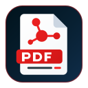

# Linkco PDF Editor app icon

  

- **Master:** [`pdfcraft.svg`](pdfcraft.svg) (`1024 × 1024` vector on Apple's icon grid: an `824 × 824` rounded-square tile with corner radius `185` at `(100, 100)`, leaving the outer margin macOS icons use).
- **Light vector:** [`pdfcraft-small.svg`](pdfcraft-small.svg) — vector version used in the README header, welcome page, and About dialog.
- **Provenance:** Original artwork created for Linkco PDF Editor (no third-party material).
- **Licence:** Dual-licensed `MIT OR Apache-2.0`, the same as the repository (`LICENSE-MIT`, `LICENSE-APACHE`, [`LICENSE.txt`](LICENSE.txt)).

## Derived files (regenerated by `packaging/icons.sh`)

| File | Where it is used |
|---|---|
| `pdfcraft-1024.png` | macOS runtime window/Dock icon (`apps/pdfcraft/src/main.rs`, on Apple's grid) |
| `pdfcraft.icns` | macOS `.app` bundle (`packaging/macos/package.sh`; `ic12`/`ic07`/`ic13`/`ic08`/`ic14`/`ic09`/`ic10`) |
| `pdfcraft.ico` | Windows executable & installer icon (`apps/pdfcraft/build.rs`, `packaging/windows/pdfcraft.wxs`, 16–256 px, full-bleed) |
| `hicolor/<n>x<n>/apps/ai.storyteller.pdfcraft.png` | Linux hicolor theme, 16–512 px; the 256 px one is the runtime icon on Windows and Linux |
| `hicolor/scalable/apps/ai.storyteller.pdfcraft.svg` | Linux scalable icon (copy of the master) |
